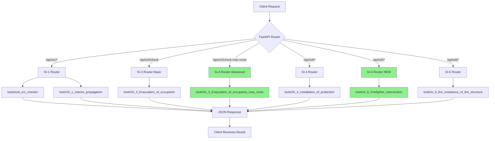

# API Wrappers Update - New Tools Integration

## Summary

The API wrappers have been updated to reflect the new `tools/` directory structure and include wrappers for newly added compliance checkers.

---

## What Changed

### 1. Directory Structure Update

**Previous:** `utils/` → **Current:** `tools/`

All router files now import from `tools.` instead of `utils.`:

```python
# Old
from utils.SI_3_Evacuation_of_occupants import detectar_tipologia

# New  
from tools.SI_3_Evacuation_of_occupants import detectar_tipologia
```

### 2. New Tool Files Discovered

| File | Status | Wrapper Created |
|------|--------|-----------------|
| `SI_1_interior_propagation.py` | ✅ Existing | si1_router.py |
| `sub_si1_checker.py` | ✅ Existing | si1_router.py |
| `SI_3_Evacuation_of_occupants.py` | ✅ Existing | si3_router.py |
| `SI_3_Evacuation_of_occupants_max_route.py` | 🆕 **NEW** | si3_router.py (`/check-max-route` endpoint) |
| `SI_4_installation_of_protection.py` | ✅ Existing | si4_router.py |
| `si_5_Firefighter_intervention.py` | 🆕 **NEW** | si5_router.py |
| `si_6_fire_resistance_of_the_structure.py` | ✅ Existing | si6_router.py |
| `si_2_exterior_propagation.py` | ⚠️ Empty | No wrapper (file is empty) |
| `_inspect_placement.py` | N/A | No wrapper (internal utility) |
| `utils_sample.py` | N/A | No wrapper (sample file) |

---

## New Wrappers Created

### 1. SI-5 Firefighter Intervention Router

**File:** `app/api/routers/si5_router.py`

**Wraps:** `tools.si_5_Firefighter_intervention.validate_firefighter_access()`

**Purpose:** Validates firefighter access windows according to Spanish DB SI 5 Section 2

**Endpoint:** `POST /api/si5/check`

**What it checks:**
- Window dimensions (≥0.8m width × ≥1.2m height)
- Sill height (between -0.05m and 1.20m from floor)
- Security bars (not allowed if evacuation height > 9m)

**Request Model:**
```json
{
  "ifc_path": "/path/to/building.ifc"
}
```

**Response Model:**
```json
{
  "summary_text": "5 out of 8 compliant",
  "total_checked": 8,
  "total_compliant": 5,
  "results": [
    {
      "element_id": "3kD5x...",
      "element_type": "IfcWindow",
      "check_status": "pass",
      "actual_value": "Compliant",
      "checks": {
        "dimensions": {...},
        "sill_height": {...},
        "security_obstruction": {...}
      }
    }
  ]
}
```

**Research Context:**
For FO-SEZ projects, this ensures emergency responder access windows are properly designed and meet regulatory requirements for firefighter intervention.

---

### 2. SI-3 Maximum Route Endpoint (Advanced)

**File:** `app/api/routers/si3_router.py` (new endpoint added)

**Wraps:** Multiple functions from `tools.SI_3_Evacuation_of_occupants_max_route`

**Purpose:** Advanced evacuation route calculation using grid-based Dijkstra pathfinding

**Endpoint:** `POST /api/si3/check-max-route`

**What it checks:**
- Maximum evacuation route distance for each space
- Single exit vs multiple exit limits
- Compliance with CTE DB-SI SI3.3 route length requirements
- Optional 25% increase for automatic fire extinction systems

**Request Model:**
```json
{
  "ifc_path": "/path/to/building.ifc",
  "typology": "Residencial Vivienda",
  "has_auto_extinction": false,
  "rules_json_path": "/path/to/regulation_rules.json"
}
```

**Response Model:**
```json
{
  "status": "non_compliant",
  "max_route_distance_m": 28.75,
  "total_spaces": 12,
  "compliant_spaces": 10,
  "non_compliant_spaces": 2,
  "blocked_spaces": 0,
  "results": [
    {
      "element_id": "2fK8j...",
      "element_type": "IfcSpace",
      "element_name": "Living Room",
      "check_status": "fail",
      "actual_value": "28.75 m",
      "required_value": "25.0 m (SI3.3 single exit)",
      "comment": "Evacuation route exceeds limit by 3.75 m"
    }
  ]
}
```

**How it works:**
1. Creates a grid representation of walkable space
2. Identifies exit doors
3. Uses Dijkstra's algorithm to calculate shortest paths from every point to exits
4. Compares maximum distances against regulatory limits
5. Reports per-space compliance

**Comparison with basic SI-3 check:**
- **Basic SI-3** (`/check`): Checks occupancy limits, exit width, evacuation heights (fast, simple)
- **Advanced SI-3** (`/check-max-route`): Calculates actual walking distances using spatial analysis (slower, more accurate)

**Research Context:**
For FO-SEZ spatial planning, this provides precise evacuation route validation accounting for actual building geometry, door positions, and space connectivity. Essential for complex multi-zone facilities.

---

## Updated Files

### Core Files Modified

1. **`app/api/models.py`**
   - Added `SI5CheckRequest` and `SI5CheckResponse`
   - Added `SI3MaxRouteRequest` and `SI3MaxRouteResponse`

2. **`app/api/routers/si5_router.py`** *(NEW FILE)*
   - Complete wrapper for firefighter intervention checks
   - Processes all IfcWindow entities in model
   - Returns detailed per-window compliance

3. **`app/api/routers/si3_router.py`** *(UPDATED)*
   - Added `/check-max-route` endpoint
   - Implements grid-based pathfinding workflow
   - Uses multiple utility functions from max_route module

4. **`app/api/routers/__init__.py`**
   - Added `si5_router` import
   - Updated `__all__` list

5. **`app/api/main.py`**
   - Imported `si5_router`
   - Registered `/api/si5` endpoint
   - Updated root endpoint to list SI-5

### Import Path Updates

All existing routers updated their imports:
- `utils.` → `tools.`

Affected files:
- `si1_router.py`
- `si3_router.py`
- `si4_router.py`
- `si6_router.py`

---

## Complete Endpoint List

After this update, the API now exposes:

| Endpoint | Method | Description |
|----------|--------|-------------|
| `/` | GET | Health check / API info |
| `/health` | GET | Health status |
| `/docs` | GET | Interactive Swagger UI |
| `/api/si1/scan` | POST | Scan IFC for SI-1 data |
| `/api/si1/check` | POST | Check sector size compliance |
| `/api/si3/check` | POST | Check evacuation compliance (basic) |
| `/api/si3/check-max-route` | POST | Check evacuation routes (advanced) |
| `/api/si3/info` | GET | SI-3 endpoint information |
| `/api/si4/check` | POST | Check fire protection installations |
| `/api/si5/check` | POST | Check firefighter intervention access |
| `/api/si6/check` | POST | Check structural fire resistance |

---

## Testing the New Endpoints

### Test SI-5 (Firefighter Intervention)

```bash
curl -X POST "http://localhost:8000/api/si5/check" \
  -H "Content-Type: application/json" \
  -d '{
    "ifc_path": "/path/to/your/building.ifc"
  }'
```

**Expected output:**
- Summary of window compliance
- Total windows checked
- Detailed results per window with dimension, sill height, and security bar checks

### Test SI-3 Max Route

```bash
curl -X POST "http://localhost:8000/api/si3/check-max-route" \
  -H "Content-Type: application/json" \
  -d '{
    "ifc_path": "/path/to/your/building.ifc",
    "typology": "Residencial Vivienda",
    "has_auto_extinction": false,
    "rules_json_path": "/path/to/data_push/regulation_rules.json"
  }'
```

**Expected output:**
- Maximum evacuation distance found
- Per-space compliance details
- Count of compliant/non-compliant/blocked spaces

---

## Research Integration for FO-SEZ Projects

### How These Updates Support Your Thesis

**1. Firefighter Intervention (SI-5):**
- Validates emergency access for large-scale food processing zones
- Ensures compliance in multi-building FO-SEZ layouts
- Critical for industrial/commercial typologies in food infrastructure

**2. Advanced Evacuation Routes (SI-3 Max Route):**
- Calculates precise evacuation paths in complex warehouse/processing facilities
- Accounts for actual spatial geometry in predictive planning models
- Provides quantitative metrics for design optimization

**3. Tool-Based Workflow:**
- All compliance checks are now accessible via REST API
- Can integrate with GIS tools (QGIS, ArcGIS) for spatial analysis
- Enables automated batch checking of multiple design scenarios

### Workflow Integration

```
┌─────────────────┐         ┌──────────────┐         ┌─────────────────┐
│ IFC Model       │────────>│ FastAPI      │────────>│ Compliance JSON │
│ (Building)      │  HTTP   │ Wrappers     │  HTTP   │ (Results)       │
└─────────────────┘         └──────────────┘         └─────────────────┘
                                   │
                                   │ Calls
                                   ▼
                            ┌──────────────┐
                            │ tools/       │
                            │ (Your Utils) │
                            └──────────────┘
```

---

## Mermaid Diagram: Updated Architecture



**Legend:**
- 🟢 Green boxes = Newly added components

---

## Next Steps

### For Development

1. **Test all endpoints** with actual IFC files
2. **Verify error handling** for edge cases (missing files, invalid IFC, etc.)
3. **Add authentication** if deploying publicly (API keys, JWT tokens)
4. **Create Docker container** for easy deployment

### For Research

1. **Connect to QGIS** using Python API client
2. **Batch process** multiple FO-SEZ design scenarios
3. **Visualize results** on maps showing compliance zones
4. **Export data** to research database for analysis

### For Production

1. **Add logging** to track API usage
2. **Implement rate limiting** to prevent abuse
3. **Set up monitoring** (uptime, response times)
4. **Deploy to cloud** (AWS, Azure, Heroku)

---

## Documentation Links

- **Quick Start Guide:** [QUICK_START.md](./QUICK_START.md)
- **Architecture Details:** [API_ARCHITECTURE.md](./API_ARCHITECTURE.md)
- **Previous Updates:** [API_UPDATE_SUMMARY.md](./API_UPDATE_SUMMARY.md)

---

## Questions or Issues?

If you encounter problems with the new endpoints:

1. **Check logs:** API prints detailed error messages
2. **Verify file paths:** IFC and JSON files must exist
3. **Check IFC content:** Files must contain required entities (IfcWindow, IfcSpace, IfcDoor)
4. **Review input data:** Use Swagger UI at `/docs` to validate request format

---

**Generated:** 2026-02-19  
**Author:** GitHub Copilot  
**Project:** Automatic Fire Compliance Checker - FO-SEZ Research
