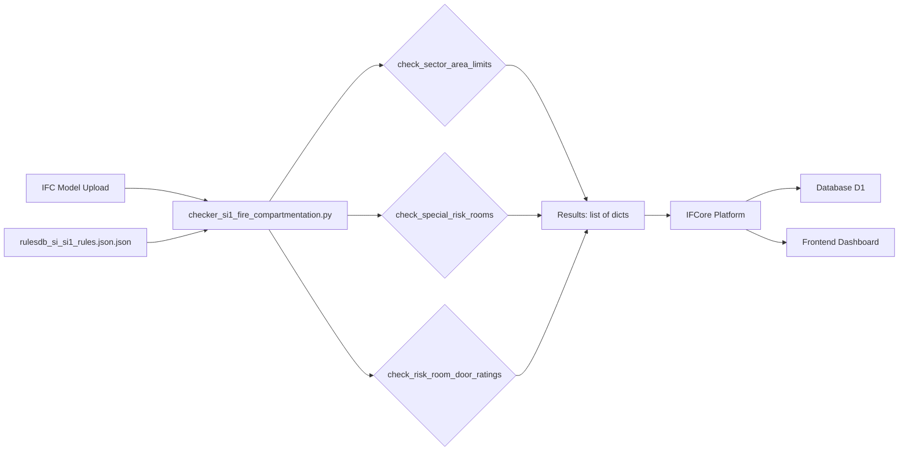
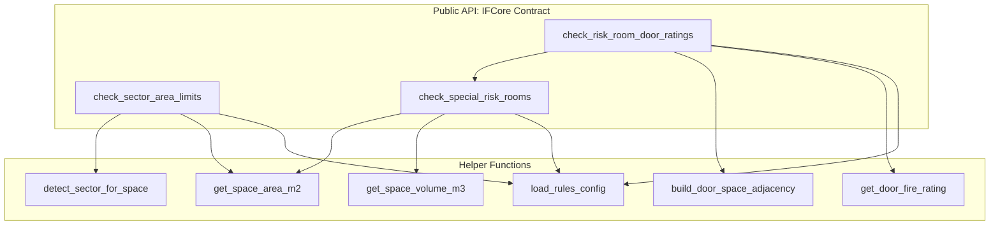
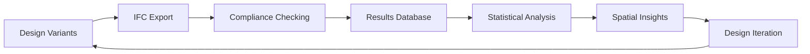

# SI1 Fire Compartmentation Checker

## What This Code Does

This checker validates Spanish Building Code (CTE) Section DB-SI SI1: Interior Fire Propagation requirements. It performs three main compliance checks:

1. **Sector Area Limits** - Verifies fire sectors don't exceed maximum area thresholds
2. **Special Risk Rooms** - Detects and classifies high-risk spaces (storage, workshops, waste areas)
3. **Risk Room Door Ratings** - Ensures doors adjacent to risk rooms have proper fire ratings

## Why It Exists

Fire compartmentation is a critical safety strategy that limits fire spread by dividing buildings into sectors. This checker automates compliance verification for:

- **Architects/Designers**: Verify designs meet regulations during planning
- **Building Officials**: Automated checking of submitted IFC models
- **Researchers**: Analyze fire safety patterns across building types

## How It Connects to Other Files

```
automatic-fire-compliance-checker/
├── tools/
│   ├── checker_si1_fire_compartmentation.py  ← NEW: IFCore-compliant checker
│   ├── _legacy_sub_si1_checker.py            ← OLD: Legacy file (reference only)
│   └── _legacy_SI_1_interior_propagation.py  ← OLD: Legacy file (reference only)
├── data_push/
│   └── rulesdb_si_si1_rules.json.json       ← Configuration: thresholds, keywords
└── app/
    └── api/
        └── routers/
            ├── si1_router.py                 ← API endpoint that calls checkers
            └── si5_router.py
```

### Data Flow



### Function Relationships



## Code Structure

### 1. Public Check Functions (Platform API)

These are the **only** functions the IFCore platform calls:

#### `check_sector_area_limits(model, building_use, has_sprinklers, config_path)`
- **Input**: IFC model, building classification, sprinkler status
- **Output**: List of check results (one per fire sector)
- **Logic**: Groups spaces by sector ID, sums areas, compares to limits

#### `check_special_risk_rooms(model, config_path)`
- **Input**: IFC model
- **Output**: List of check results (one per detected risk room)
- **Logic**: Matches space names against keywords, classifies by area/volume thresholds

#### `check_risk_room_door_ratings(model, config_path)`
- **Input**: IFC model
- **Output**: List of check results (one per risk room boundary door)
- **Logic**: Finds risk rooms, maps doors via space boundaries, validates fire ratings

### 2. Helper Functions (Internal Use Only)

- `load_rules_config()` - Loads thresholds and keywords from JSON
- `detect_sector_for_space()` - Assigns sector ID to a space
- `get_space_area_m2()` - Extracts floor area from IFC properties
- `get_space_volume_m3()` - Extracts volume from IFC properties
- `build_door_space_adjacency()` - Maps doors to adjacent spaces
- `get_door_fire_rating()` - Extracts fire rating from door properties

### 3. IFC Utilities

- `safe_attr()` - Safely get attributes from IFC elements
- `get_psets()` - Extract property sets (Pset_*, Qto_*)
- `build_storey_map()` - Map elements to building storeys
- `get_space_zones()` - Get IfcZone assignments for spaces

## Research Framework Connection

### Research Problem This Code Supports

**Problem**: Manual building code compliance checking is slow, subjective, and error-prone. For spatial research (like Food-Oriented SEZs), automated validation enables:
- Rapid iteration on design alternatives
- Quantitative compliance scoring across variants
- Data-driven insights into code constraints on spatial planning

**This checker helps answer**: 
- Which spatial layouts comply with fire safety regulations?
- How do fire sector constraints affect space allocation?
- What building volumes can be achieved within compartmentation limits?

### Input Data

| Data Source | Format | Example |
|------------|--------|---------|
| Building geometry | IFC file (`IfcSpace`, `IfcDoor`, `IfcWall`) | `model.ifc` |
| Fire safety rules | JSON config | `rulesdb_si_si1_rules.json.json` |
| Building parameters | Function arguments | `building_use="residencial_vivienda"` |

### Output Data

**Format**: List of dictionaries following IFCore schema

```python
{
    "element_id": "2O2Fr$t4X7Zf8NOew3FNr2",  # IFC GlobalId
    "element_type": "IfcSpace",              # IFC class
    "element_name": "Storage Room",
    "element_name_long": "Storage Room (Level 1)",
    "check_status": "fail",                  # pass / fail / warning / blocked
    "actual_value": "450.0 m³",
    "required_value": "< 400.0 m³",
    "comment": "HIGH risk: requires special fire protection",
    "log": "Type: combustible_storage, Risk: HIGH"
}
```

**Consumed by**:
- Platform database (Cloudflare D1)
- Frontend dashboard (compliance visualization)
- Analysis scripts (aggregate compliance metrics)

### How This Fits Into the Research Pipeline



**Step in Pipeline**: Compliance Checking (Step 3)

**Previous Step**: IFC models generated from parametric design tools (Revit, Rhino+Grasshopper, etc.)

**Next Step**: Results aggregated for comparative analysis (e.g., "What % of plan variants comply?")

## Changes From Legacy Files

### Old Approach (Non-Compliant)
- Functions took **file paths** as input: `run_si1_checks(ifc_path: str)`
- Returned **nested dictionaries**: `{"file_name": ..., "sectors": {...}, "si1_sector_size": {...}}`
- Required manual parsing to extract individual element results
- CLI-focused, not designed for platform integration

### New Approach (IFCore-Compliant)
- Functions take **model objects** as input: `check_sector_area_limits(model: ifcopenshell.file)`
- Return **flat lists** of result dicts: `[{element_id, check_status, ...}, ...]`
- Direct database insertion without transformation
- Platform-first design (CLI testing via `__main__` block)

### Migration Path

The old files are **kept for reference** but renamed to prevent platform discovery:
- `_legacy_sub_si1_checker.py` - Original implementation (renamed from checker_sub_si1_checker.py)
- `_legacy_SI_1_interior_propagation.py` - Enhanced version with door checks (renamed from checker_SI_1_interior_propagation.py)

To use legacy files locally for testing:
```python
from tools._legacy_sub_si1_checker import run_si1_checks
results = run_si1_checks("path/to/model.ifc", "path/to/config.json")
```

**For platform deployment**, only import from the new file:
```python
from tools.checker_si1_fire_compartmentation import check_sector_area_limits
model = ifcopenshell.open("model.ifc")
results = check_sector_area_limits(model)
```

## Configuration

Rules are defined in `data_push/rulesdb_si_si1_rules.json.json`:

```json
{
  "sector_limits_m2": {
    "residencial_vivienda": {
      "base_limit_m2": 2500.0,
      "sprinkler_multiplier": 2.0
    }
  },
  "special_risk_rooms": {
    "types": {
      "combustible_storage_or_archive": {
        "keywords": ["storage", "archive", "warehouse"],
        "metric": "volume_m3",
        "thresholds": {
          "low": {"gt": 100.0, "lte": 200.0},
          "medium": {"gt": 200.0, "lte": 400.0},
          "high": {"gt": 400.0}
        }
      }
    }
  }
}
```

See [configuration schema documentation](../data_push/CONFIG_SCHEMA.md) for full details.

## Local Testing

```bash
# Test with a single IFC file
python tools/checker_si1_fire_compartmentation.py path/to/model.ifc

# Expected output:
# ================================================================================
# CTE DB-SI SI1 Fire Compartmentation Checks
# ================================================================================
# 
# 1. Sector Area Limits
# --------------------------------------------------------------------------------
# [PASS] SECTOR_1: 1850.3 m² (limit: ≤ 2500.0 m²)
# 
# 2. Special Risk Rooms
# --------------------------------------------------------------------------------
# [WARNING] Storage Room: 250.0 m³
#        → MEDIUM risk: additional requirements may apply
# ...
```

## Platform Integration

The IFCore platform automatically discovers and runs these checks:

1. Platform scans `tools/checker_*.py` files
2. Finds all functions starting with `check_`
3. For each uploaded IFC model, calls:
   ```python
   model = ifcopenshell.open(uploaded_file)
   results = check_sector_area_limits(model)
   results += check_special_risk_rooms(model)
   results += check_risk_room_door_ratings(model)
   ```
4. Stores results in database
5. Displays in frontend dashboard

No registration or wrapper code needed - **just follow the naming conventions**.

## Common Issues

### Issue: "No sector limits configured"
**Cause**: Missing or incorrect `building_use` parameter  
**Fix**: Check `rulesdb_si_si1_rules.json.json` has entry for your building type

### Issue: "Cannot map doors to spaces"
**Cause**: IFC model lacks `IfcRelSpaceBoundary` relationships  
**Fix**: Re-export IFC with "Space Boundaries" option enabled in your BIM tool

### Issue: "Missing area data"
**Cause**: Spaces don't have `Qto_SpaceBaseQuantities` or geometry  
**Fix**: Ensure spaces have area quantities in IFC (check with IFC viewer)

## Next Steps

- [ ] Add more building use types to configuration
- [ ] Implement opening protection checks (wall/floor penetrations)
- [ ] Add evacuation route validation (SI3)
- [ ] Integrate with parametric design tools (live feedback)

## References

- **CTE DB-SI**: Spanish Building Code, Fire Safety Section
  - Section SI1: Interior Propagation
  - Table 2.1: Special Risk Room Classification
- **IFCore Skill**: [SKILL.md](~/.copilot/skills/IFCore-skill/SKILL.md)
- **IFC Schema**: [buildingSMART IFC 4.3 Documentation](https://standards.buildingsmart.org/IFC/)
